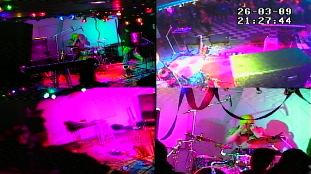

# no-fun-media-engine

Unattended pipeline that turns each night's live-venue recordings into finished, shareable assets. A Textual TUI engine watches the record folder and, per performance, produces:

- **4-quadrant camera MP4s** (GPU-encoded) plus 320×180 proxy clips for the venue's video walls
- **Multitrack audio archives** — ~32 channels as 24-bit FLAC inside one `_MULTITRACK.zip`
- **Mastered stereo mix** (`_AUDIO.mp3`, loudness-normalised to −12 LUFS) and a 9:16 **Instagram reel** (`_INSTAGRAM.mp4`)
- **Cloud delivery** — completed performances sync to OneDrive/SharePoint on a 28-day lease

<p align="center">
  
</p>

Everything runs from a scheduled job queue with GPU and CPU lanes, storage tiers (NAS primary with local fallback and backup mirrors), automatic raw/cloud expiry, and a self-auditing cleanup pass. Companion scripts stream the clip library to the venue's TVs (`start-streams.ps1`, `scripts/streams/`).

Audio input is ~32 pre-separated single-channel WAVs per performance in a `VenueLighting/Audio/` subfolder; video input is the multi-camera `.mov` from the recorder.

## Requirements

- Python 3.13+
- [uv](https://github.com/astral-sh/uv)
- ffmpeg / ffprobe on PATH

## Install

```
uv sync
```

## Run

```
uv run python media_engine.py
```

Launches in TUI/watchdog mode. Watches `SEARCH_DIR` and processes recordings as they arrive.

## Environment variables

All storage locations resolve through one `StorageConfig` (`nofun/storage_config.py`),
built from these variables at startup; the resolved layout is logged once on boot
(`Storage layout …`). Every default reproduces the paths below, so a standard box needs
none of them — set only what differs on another machine.

| Variable | Default | Notes |
|---|---|---|
| `SEARCH_DIR` | `C:\Users\<username>\VenueLighting` | Source directory to watch |
| `MOUNT_D` | `D:/` | Output drive root |
| `MOUNT_C` | `C:/` | Companion override (rarely needed) |
| `CLIPS_ROOT` | `C:\clips` | Clip output directory (C: SSD streaming primary; never follows the NAS). `D:\clips` is deprecated — see `docs/guides/clip-storage.md` |
| `NAS_ROOT` | _(unset)_ | NAS media root; falls back to `MOUNT_D` when unreachable |
| `SHAREPOINT_DEST` | `…\<user>\OneDrive - No Fun Troy LLC\Multitracks` | OneDrive sync folder (cloud disabled if absent) |
| `VIDEOS_SUBDIR` | `videos` | Media subdir name under the media root |
| `AUDIO_SUBDIR` | `audio` | Media subdir name under the media root |
| `VIDEO_ARCHIVE_SUBDIR` | `video_archive` | Archive subdir name (also names the D: backup tier) |
| `AUDIO_ARCHIVE_SUBDIR` | `audio_archive` | Archive subdir name |

## Output layout

All output lands on `MOUNT_D`. Directories are created on first run.

| Path | Contents |
|------|----------|
| `D:\videos\` | Quadrant MP4s and `_INSTAGRAM.mp4` reels |
| `C:\clips\` | Proxy clip segments (SSD streaming primary; `D:\clips` deprecated) |
| `D:\audio\` | `_MULTITRACK.zip` (per-channel 24-bit FLAC) and mastered `_AUDIO.mp3` per performance |
| `D:\video_archive\` | Source MOVs archived after encoding (auto-deleted after 30 days) |
| `D:\audio_archive\` | Source WAVs archived after splitting (same expiry) |
| `D:\logs\` | Rotating log files |

## GPU encoding

Uses `h264_amf` (AMD AMF) on Windows when available. Pass `--no-gpu` to fall back to `libx264`.

```
ffmpeg -encoders 2>nul | findstr amf
```

## OneDrive sync

Completed performances are synced to the first `C:\Users\<username>\OneDrive - *\Multitracks\` folder found. Skipped gracefully if absent.

## Tests

```
uv run pytest
```

## Further reading

- `docs/guides/architecture.md` — mixin diagram, threading model, PAUSE state machine
- `docs/guides/filename-conventions.md` — source, quadrant, clip, audio, and ZIP naming formats
- `docs/guides/prod-processes.md` — prod scheduled tasks, process families, and health checks

## License

[MIT](LICENSE)
